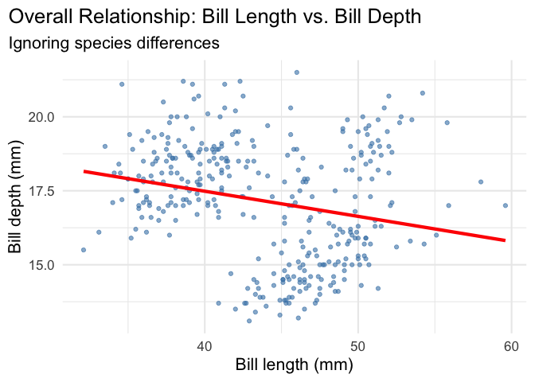

# Understanding Simpson’s Paradox


## Introduction to Simpson’s Paradox

**Simpson’s Paradox** is one of the most fascinating and dangerous
phenomena in data analysis. It occurs when a trend appears in different
groups of data but disappears or reverses when these groups are
combined. This paradox can lead to completely wrong conclusions if we
don’t look beyond surface-level statistics.

The classic example comes from UC Berkeley’s 1973 graduate admissions
data, where women appeared to be discriminated against in the overall
admission rates, but when examined by department, women actually had
equal or higher admission rates than men.

In this tutorial, we’ll explore Simpson’s Paradox using the beloved
Palmer Station penguin dataset, examining the relationship between bill
length and bill depth across different penguin species.

``` r
# Set CRAN mirror for package installation
options(repos = c(CRAN = "https://cran.rstudio.com/"))

# Install required packages if not already installed
# Try to load patchwork, if it fails, we'll use an alternative approach
suppressWarnings({
  if (!require(patchwork, quietly = TRUE)) {
    install.packages("patchwork")
  }
})
```


    The downloaded binary packages are in
        /var/folders/r0/lvgnmfm51wv5cw4b4whl7v2r0000gn/T//Rtmp48Wbgw/downloaded_packages

``` r
# Load patchwork with error handling
patchwork_available <- tryCatch({
  library(patchwork)
  TRUE
}, error = function(e) {
  cat("Note: patchwork not available, using alternative approach\n")
  FALSE
})
```

    Note: patchwork not available, using alternative approach

``` r
if (!require(palmerpenguins, quietly = TRUE)) {
  install.packages("palmerpenguins")
  library(palmerpenguins)
}
library(ggplot2)
data(penguins)
```

## The Data Story: Penguin Bill Dimensions

Let’s start by examining our data and building up to the paradox step by
step.

### A. The Overall Relationship

``` r
plot1 <- ggplot(data = penguins,
        aes(x = bill_length_mm,
        y = bill_depth_mm)) +
  theme_minimal(16) +
  geom_point(alpha = 0.6, color = "steelblue") +
  labs(title = "Overall Relationship: Bill Length vs. Bill Depth",
       subtitle = "Ignoring species differences",
       x = "Bill length (mm)",
       y = "Bill depth (mm)") +
  theme(plot.title.position = "plot",
        plot.caption = element_text(hjust = 0, face= "italic"),
        plot.caption.position = "plot") +
  geom_smooth(method = "lm", se = FALSE, color = "red", linewidth = 1.5)

plot1
```



At first glance, we see a **positive relationship** between bill length
and bill depth. The red trendline suggests that longer bills tend to be
deeper. This seems straightforward, but let’s dig deeper…

### B. The Hidden Truth: Species-Specific Relationships

Now let’s color our points by species and see what happens when we
examine the relationship within each group:

``` r
plot2 <- ggplot(data = penguins,
       aes(x = bill_length_mm,
           y = bill_depth_mm,
           color = species)) +
  theme_minimal(16) +
  geom_point(alpha = 0.7) +
  scale_color_manual(values = c("darkorange","purple","cyan4"),
                     name = "Species") +
  labs(title = "Simpson's Paradox Revealed!",
       subtitle = "The relationship reverses when we consider species",
       x = "Bill length (mm)",
       y = "Bill depth (mm)",
       caption = "Red line: Overall trend | Colored lines: Within-species trends") +
  theme(plot.title.position = "plot",
        plot.caption = element_text(hjust = 0, face = "italic"),
        plot.caption.position = "plot",
        legend.position = "bottom") +
  # Overall trend (ignoring species)
  geom_smooth(method = "lm", se = FALSE, color = "red", 
              linewidth = 1.5, alpha = 0.8) +
  # Species-specific trends
  geom_smooth(method = "lm", se = FALSE, linewidth = 1)

plot2
```


**The Paradox Revealed!** 🎯

Notice what just happened: - **Overall trend (red line):** Positive
relationship - longer bills are deeper - **Within each species (colored
lines):** Negative relationship - longer bills are actually shallower!

This is Simpson’s Paradox in action. The species variable is a
**confounding variable** that completely reverses the apparent
relationship when we aggregate the data.

### C. Side-by-Side Comparison

**🎯 Side-by-Side Comparison: The Power of Simpson’s Paradox**

``` r
# Create the side-by-side comparison using patchwork
if (patchwork_available) {
  # Use patchwork if available
  comparison_plot <- plot1 + plot2 +
    plot_annotation(
      title = "Simpson's Paradox: The Deceptive Nature of Aggregated Data",
      subtitle = "Left: Overall relationship suggests positive correlation | Right: Species-specific analysis reveals negative correlation",
      caption = "This visualization demonstrates how ignoring grouping variables can lead to completely opposite conclusions about the same dataset. The red trendline in both plots shows the overall relationship, while the colored lines in the right plot reveal the true within-species relationships.",
      theme = theme_minimal(16) +
        theme(
          plot.title = element_text(size = 18, face = "bold", hjust = 0.5),
          plot.subtitle = element_text(size = 14, hjust = 0.5, margin = margin(b = 20)),
          plot.caption = element_text(size = 12, hjust = 0, face = "italic", margin = margin(t = 20)),
          plot.caption.position = "plot"
        )
    )
} else {
  # Fallback to gridExtra if patchwork is not available
  if (!require(gridExtra, quietly = TRUE)) {
    install.packages("gridExtra")
    library(gridExtra)
  }
  library(grid)  # Required for textGrob and gpar functions
  
  # Add titles to individual plots
  plot1_with_title <- plot1 + 
    labs(title = "Overall Relationship",
         subtitle = "Ignoring species differences")
  
  plot2_with_title <- plot2 + 
    labs(title = "Species-Specific Relationships",
         subtitle = "The truth revealed when we consider species")
  
  # Create side-by-side comparison
  comparison_plot <- grid.arrange(
    plot1_with_title, 
    plot2_with_title, 
    ncol = 2,
    top = textGrob("Simpson's Paradox: The Deceptive Nature of Aggregated Data", 
                   gp = gpar(fontsize = 18, fontface = "bold")),
    bottom = textGrob("This visualization demonstrates how ignoring grouping variables can lead to completely opposite conclusions about the same dataset.\nThe red trendline in both plots shows the overall relationship, while the colored lines in the right plot reveal the true within-species relationships.", 
                      gp = gpar(fontsize = 12, fontface = "italic"), 
                      x = 0, hjust = 0)
  )
}
```


``` r
comparison_plot
```

    TableGrob (3 x 2) "arrange": 4 grobs
      z     cells    name                grob
    1 1 (2-2,1-1) arrange      gtable[layout]
    2 2 (2-2,2-2) arrange      gtable[layout]
    3 3 (1-1,1-2) arrange text[GRID.text.230]
    4 4 (3-3,1-2) arrange text[GRID.text.231]

**What you should see:** A powerful visualization that makes Simpson’s
Paradox crystal clear - the same data telling two completely different
stories depending on whether we consider the species grouping variable.

## Key Takeaways: Lessons from Simpson’s Paradox

### The Power of Visualization

- **Always visualize your data** before drawing conclusions from
  statistical models
- A single trendline can be dangerously misleading when it masks
  underlying group differences
- **P-values are not the answer** - statistical significance doesn’t
  guarantee the relationship is meaningful or correctly interpreted

### Simpson’s Paradox Dangers

- **Aggregated data can reverse relationships** - what appears to be a
  positive correlation overall might be negative within each group
- **Business implications:** Making decisions based on aggregate trends
  without considering subgroups can lead to costly mistakes
- **The “lurking variable” problem:** Always ask “What am I missing?”
  when relationships seem counterintuitive

### Real-World Examples

- **UC Berkeley admissions (1973):** Overall admission rates suggested
  gender bias against women, but within each department, women had equal
  or higher admission rates
- **Baseball batting averages:** A player can have a higher batting
  average than another in both halves of a season, yet a lower overall
  average
- **Medical studies:** A treatment can appear harmful overall but
  beneficial within each age group
- **Marketing campaigns:** A campaign might seem ineffective overall but
  highly successful within specific customer segments

### Best Practices for Data Analysis

- **Stratify your analysis** by relevant grouping variables
  (demographics, categories, time periods)
- **Look for confounding variables** that might explain apparent
  relationships
- **Use multiple visualization approaches** (overall vs. faceted plots,
  side-by-side comparisons)
- **Question your assumptions** - if a relationship seems too good (or
  bad) to be true, it might be!

## Conclusion

Simpson’s Paradox teaches us that **context matters**. The penguin data
shows us that what appears to be a simple positive relationship between
bill length and depth is actually masking a more complex reality where
the relationship is negative within each species. This paradox reminds
us to always dig deeper, consider confounding variables, and never trust
aggregate statistics without examining the underlying groups.

Remember: **The truth is in the details, not in the summary
statistics.**
